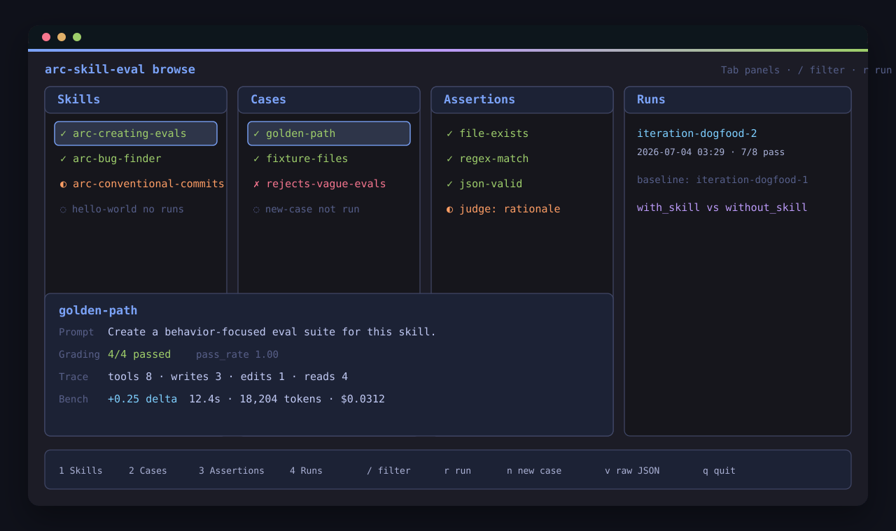

# arc-skill-eval

Pi-native library and CLI for running skill evals. It uses [Anthropic's published `evals/evals.json` format](https://platform.claude.com/docs/en/agents-and-tools/agent-skills). The grading method comes from OpenAI's [Testing Agent Skills Systematically with Evals](https://developers.openai.com/blog/eval-skills): start with a small suite, add cases from real failures, and compare the same prompts with and without the skill. The runtime design draws on Ampcode's [How to Build an Agent](https://ampcode.com/notes/how-to-build-an-agent) and Mihail Eric's [The Emperor Has No Clothes](https://www.mihaileric.com/The-Emperor-Has-No-Clothes/). See [Inspiration and credits](#inspiration-and-credits) for details.

## What it does
Given a skill that ships `SKILL.md` and a sibling `evals/evals.json`, `arc-skill-eval`:

1. discovers every `SKILL.md` + `evals/evals.json` pair under a repo.
2. materializes each case's optional `files/` into a temp workspace.
3. runs the case through the Pi SDK with the skill attached.
4. grades string assertions with an LLM judge and checks `file-exists`, `regex-match`, and `json-valid` assertions with scripts.
5. writes per-case `assistant.md` + `outputs/` + `timing.json` + `grading.json` + observability artifacts under `<skill>/evals-runs/<runId>/`.
6. tracks model, thinking level, token usage, estimated cost, context-window size, and context percentage used.
7. records tool-call counts, skill reads, external calls, MCP-looking tool calls, and the context/tool manifest exposed to the model.
8. optionally compares each case against a no-skill baseline with `--compare`.

Assertion grading mirrors OpenAI's layered approach (deterministic checks first, model-assisted rubric for prose) and emits artifacts in Anthropic's published [`grading.json`](https://platform.claude.com/docs/en/agents-and-tools/agent-skills) shape.

## Input format
`<skill-dir>/evals/evals.json`:
```json
{
  "skill_name": "arc-conventional-commits",
  "evals": [
    {
      "id": 1,
      "prompt": "Set up semantic-release in this repo.",
      "expected_output": "semantic-release configured with the Conventional Commits preset.",
      "files": ["files/clean-repo"],
      "assertions": [
        { "type": "file-exists", "path": ".releaserc.json" },
        { "type": "regex-match", "pattern": "conventionalcommits", "target": { "file": ".releaserc.json" } },
        "The response summarizes the semantic-release plugins it installed."
      ]
    }
  ]
}
```

Each case may also set `"sandbox": "just-bash"` to run inside an isolated virtual bash environment instead of the default temp-workspace runner (`"none"`). A `--sandbox` CLI flag overrides this per run. In `just-bash` mode the agent's `bash` tool executes in an in-process virtual shell with a filesystem rooted at the case workspace, so command execution needs no host shell and the repository working tree is never touched.

`just-bash` ships core unix builtins; `npm`, `npx`, and `git` get deterministic no-op success mocks by default. Override them per case with `sandboxMocks` to return specific output, exit codes, and file effects:

```json
{
  "id": "install-deps",
  "prompt": "Install dependencies.",
  "sandbox": "just-bash",
  "sandboxMocks": [
    {
      "command": "npm",
      "stdout": "added 1 package\n",
      "exitCode": 0,
      "files": [{ "path": "node_modules/.installed", "content": "ok" }]
    }
  ]
}
```

## Requirements
- Node.js ≥ 20
- Pi installed and configured with at least one provider API key (Anthropic, OpenAI, Google/Gemini, Mistral, xAI, etc.). The skill's assistant runs via `@mariozechner/pi-coding-agent`.

## Install

### From a local checkout
```bash
npm install
npm run build
npm link
arc-skill-eval --help
```

### From a published package
```bash
npm install --global arc-skill-eval
arc-skill-eval --help
arc-skill-eval run "$(arc-skill-eval bundled hello-world)"
```

## Usage

```bash
# Scaffold a starter eval suite next to a SKILL.md
arc-skill-eval create ./skills/my-skill

# Preview the generated evals.json without writing it
arc-skill-eval create ./skills/my-skill --dry-run

# Review a human-readable summary of generated cases/assertions
arc-skill-eval create ./skills/my-skill --dry-run --summary

# Ask a configured model to propose richer starter cases without writing files
arc-skill-eval create ./skills/my-skill --guided --dry-run --summary

# Interactively accept, skip, or edit proposed cases/assertions before writing
arc-skill-eval create ./skills/my-skill --guided --interactive

# Run every eval in every discovered skill under the current repo
arc-skill-eval run .

# Run one skill
arc-skill-eval run ./skills/arc-conventional-commits

# Run one case inside one skill
arc-skill-eval run ./skills/arc-conventional-commits --case 1

# Pin the skill runner model and LLM-judge model
arc-skill-eval run ./skills/arc-conventional-commits \
  --model openai-codex/gpt-5.5:medium \
  --judge-model mistral/ministral-8b-latest

# Create a tiny eval-owned Pi config/runtime directory
arc-skill-eval init-runtime ./.arc-skill-eval/pi-agent \
  --provider ollama-cloud \
  --model gpt-oss:20b

# Use an eval-owned Pi config/runtime directory
arc-skill-eval run ./skills/hello-world \
  --agent-dir ./.arc-skill-eval/pi-agent \
  --model ollama-cloud/gpt-oss:20b \
  --judge-model ollama-cloud/gpt-oss:20b

# Generate a static HTML review report and feedback template from run artifacts
arc-skill-eval review ./skills/hello-world/evals-runs/<runId>

# Propose eval improvements from review feedback without writing files
arc-skill-eval improve --from-feedback ./skills/hello-world/evals-runs/<runId>/feedback.json \
  --dry-run --summary

# Retarget output to a different workspace root
arc-skill-eval run . --output-dir ./evals-runs

# Machine-readable JSON
arc-skill-eval run . --json

# Opt into with_skill vs without_skill comparison
arc-skill-eval run . --compare

# Group artifacts under an iteration bucket
arc-skill-eval run . --iteration 1

# Add explicit distractor/conflict skills to the model context
arc-skill-eval run ./skills/arc-conventional-commits \
  --compare \
  --extra-skill ./skills/release-please \
  --iteration conflict-1

# Opt into normal Pi ambient resources such as configured extensions/tools
# while recording the resulting loadout in context-manifest.json
arc-skill-eval run ./skills/arc-conventional-commits \
  --context-mode ambient \
  --iteration ambient-1
```

### Recommended first dogfood run

The companion [`andysolomon/arc-skills`](https://github.com/andysolomon/arc-skills) repo ships a dogfood suite for `arc-creating-evals`, the meta-skill that authors eval suites for other skills. After cloning both repos, run this end-to-end smoke test:

```bash
arc-skill-eval run /path/to/arc-skills/arc-creating-evals \
  --case execution-golden-path-file-skill \
  --model openai-codex/gpt-5.5:medium \
  --judge-model openai-codex/gpt-5.5:medium
```

For the with-skill / without-skill signal:

```bash
arc-skill-eval run /path/to/arc-skills/arc-creating-evals \
  --case execution-golden-path-file-skill \
  --compare \
  --iteration dogfood-1 \
  --model openai-codex/gpt-5.5:medium \
  --judge-model openai-codex/gpt-5.5:medium
```

A recent dogfood run passed the golden-path case and showed a positive `+16.7%` with-skill delta after tightening the suite to assert behavior unique to `arc-creating-evals`.

### Create starter evals

Generate a valid starter suite for a skill directory:

```bash
arc-skill-eval create ./skills/my-skill
```

The command reads `SKILL.md` frontmatter, writes `evals/evals.json`, and includes three starter cases:

- `trigger-explicit`
- `execution-golden-path`
- `adjacent-negative`

When obvious output artifacts are mentioned in `SKILL.md`, such as `plan.md` or `report.json`, the execution case also gets deterministic `file-exists` and `json-valid` assertions. When likely input files are mentioned, such as `notes/input.md`, `requirements.md`, `prd.md`, `issue.md`, or `task.md`, the execution case gets seeded fixture inputs under `evals/files/starter-inputs/`. The adjacent-negative case is domain-aware for common skill types like eval authoring, planning, releases, docs, and auth/webhooks, with a generic fallback. Use `--dry-run` to print the proposed JSON without writing files, `--summary` to print a human-readable review of generated cases/assertions, and `--force` to overwrite an existing `evals/evals.json`.

Use deterministic `create` first when the skill has concrete file, JSON, or command-line effects. It is fast, repeatable, CI-friendly, and never spends model tokens. Use `create --guided` when the hardest part is deciding what to test: conceptual interview skills, planning/review skills, routing skills with subtle adjacent negatives, or skills where success is mostly semantic. Guided mode asks the configured Pi model to design a richer proposal using the bundled `skills/arc-creating-evals/SKILL.md` procedure, then validates the returned `evals.json` with the same loader used by `run` before printing or writing anything. You can pin the designer with `--model <provider/model[:thinking]>`, use `--agent-dir <path>` for eval-owned model/auth lookup, or pass `--authoring-skill <path>` to test a different eval-authoring skill.

Use interactive guided mode to review the proposed suite before it is written:

```bash
arc-skill-eval create ./skills/my-skill --guided --interactive
```

The prompt flow shows the rationale, cases, fixture inputs, and assertions. You can include or skip cases and assertions, and edit prompts, expected output, and judge or regex assertions. Existing overwrite protections still apply unless you pass `--force`.

For example, a conceptual `grill-me` skill that conducts a relentless interview may not create files at all. Its suite should lean on judge assertions such as "asks direct follow-up questions about assumptions and tradeoffs" plus adjacent negatives that should *not* trigger the skill, rather than fake `file-exists` checks. That makes the eval measure the behavior the skill actually promises.

### Prefer behavior-focused assertions

Write assertions against observable behavior and artifacts, not incidental wording. Brittle wording checks fail when a correct assistant paraphrases, changes a heading, or omits a phrase the skill never promised.

Prefer:

```json
{ "type": "file-exists", "path": ".releaserc.json" },
{ "type": "regex-match", "pattern": "conventionalcommits", "target": { "file": ".releaserc.json" } },
"The response names semantic-release and explains that it configured release automation for this repository."
```

Avoid unless the words are truly the product requirement:

```json
"The response says exactly: Phase 1, detection complete."
```

Exact wording is appropriate for user-facing contracts such as a required commit message, CLI output, email subject, or safety disclaimer. When wording is required, make it explicit in `expected_output` and use a deterministic `regex-match` or `exact` output assertion so failures explain the missing text directly.

The positional `<skill-dir-or-repo>` for `run` is resolved as:
- a skill directory if it contains `evals/evals.json`,
- otherwise a repo whose tree is walked for SKILL.md + evals/evals.json pairs.

### Audit skill quality

Run deterministic skill-authoring checks without invoking a model:

```bash
arc-skill-eval audit ./skills
arc-skill-eval audit ./skills/my-skill --json
arc-skill-eval audit ./skills --output skill-audit.md
```

`audit` reports frontmatter issues, long descriptions, `SKILL.md` sprawl, missing `evals/evals.json`, broken local markdown reference links, trigger-heavy descriptions on user-invoked skills, and likely duplicate skill families. It exits successfully by default so it can be used as a report generator; use the finding counts in JSON output if CI needs custom failure thresholds.

### Review reports

Turn a run directory into a static review bundle:

```bash
arc-skill-eval review ./skills/hello-world/evals-runs/<runId>
```

This writes `review.html` and `feedback.json` into the run directory. Use `--output <dir>` to write elsewhere and `--force` to overwrite an existing report. Compare runs are rendered with `with_skill` and `without_skill` variants side-by-side.

Run the create, test, review, and improve cycle:

```bash
arc-skill-eval create ./skills/my-skill --guided --interactive
arc-skill-eval run ./skills/my-skill --case execution-golden-path
arc-skill-eval run ./skills/my-skill --compare --iteration dogfood-1
arc-skill-eval review ./skills/my-skill/evals-runs/iteration-dogfood-1/<runId>
arc-skill-eval improve \
  --from-feedback ./skills/my-skill/evals-runs/iteration-dogfood-1/<runId>/feedback.json \
  --dry-run --summary
```

Use `review.html` to inspect assistant output, grading evidence, artifacts, and with/without-skill deltas. Capture human notes in `feedback.json`; feedback-driven improvement can then turn those notes into a focused plan for changing the skill, tightening assertions, or adding cases.

### Improve from feedback

The command reads human notes plus failing assertion summaries and proposes prompt, assertion, fixture, or adjacent-negative changes with rationale. It does not change files unless you pass `--apply`. Applied changes annotate matching eval cases with validated improvement metadata so the suite remains loadable by `run`.

### Browse runs interactively

Open an interactive terminal run browser (an Ink TUI) over the artifacts under `evals-runs/`:

```bash
arc-skill-eval browse ./skills/arc-conventional-commits   # one skill
arc-skill-eval browse .                                    # whole repo
```

It renders four lazygit-style panels for Skills, Cases, Assertions, and Runs. The main pane shows the selected case's prompt, grading evidence, metrics, and with/without-skill comparison. It reads the same per-case `grading.json` and `timing.json` files that `run` writes, so it needs no extra setup.



Navigation:

See the **[keybindings reference](https://andysolomon.github.io/arc-skill-eval/keymap/)** for the full keymap. The docs and the in-TUI `?` overlay both read [`src/tui/keymap.ts`](src/tui/keymap.ts), so they stay in sync. Common keys include `Tab` or `1`–`4` to switch panels, `j`/`k` to move, `→`/`l`/`↵` to open details, `[`/`]` to change case mode, `v` to view raw `grading.json`, `/` to filter, `s` to sort, `c` to pin a baseline, `r`/`R` to run, `n` to add a case, `?` for help, and `q` to quit.

Runs and authoring happen **in-process, without leaving the TUI**:

- `r` / `R` run evals for the selection in a live run console (spinner, per-case progress, pass/fail summary); on completion the affected skill reloads in place and your selection is restored. `R` adds `--compare` (`with_skill` vs `without_skill`). `Esc` aborts an in-flight run; `↵` reloads and closes when it's done.
- `o` runs with custom flags such as `--model`, `--iteration`, and `--extra-skill`. This path uses a child process. The `arc-skill-eval` binary must be on `PATH`; set `ARC_SKILL_EVAL_BIN` to use another path.
- `n` scaffolds a new eval case into `evals/evals.json`; `f` records a `feedback.json` note for the selected case (consumed by `improve`).

Display options:

- `--no-baseline` hides the `without_skill` comparison rows in the detail pane (handy when you only ran the skill variant).
- The TUI is capability-aware: truecolor hex degrades to 16-color ANSI on low-color terminals, and block/box glyphs (bars, status ticks, accent bar) fall back to ASCII off a UTF-8 locale. Force the fallbacks with `NO_COLOR` / `FORCE_COLOR=0` (no color) or `ARC_TUI_ASCII=1` (ASCII glyphs).

Model options:
- `--model <provider/model[:thinking]>` pins the skill runner model instead of using Pi's configured default. Example: `openai-codex/gpt-5.5:medium`.
- `--judge-model <provider/model[:thinking]>` pins the model used for LLM-judged string assertions. Deterministic assertions do not use the judge.
- `--agent-dir <path>` points Pi settings, model registry, and auth lookup at an eval-owned agent directory instead of the normal `~/.pi/agent` directory.
- When no model flags are supplied, `arc-skill-eval` inherits Pi's default provider/model/thinking level from the effective Pi agent settings.

### Export results to Laminar Evaluations (optional)

`run --laminar` reports each run variant (`with_skill` and `without_skill`) to [Laminar](https://www.lmnr.ai/)'s **Evaluations** view. Each case becomes one scored datapoint, grouped by skill name for side-by-side comparison. The option is off by default. Local `evals-runs/` artifacts remain the canonical record, and an export failure never fails the run.

```bash
LMNR_PROJECT_API_KEY=lmnr_... arc-skill-eval run . --laminar
```

The run summary prints a direct dashboard link per evaluation. Each datapoint carries numeric scores (`pass_rate`, `passed`, `failed`, `total_tokens`, `cost_usd`, `duration_ms`, `tool_calls`) and an output with the grading summary, per-assertion verdicts (assertion text, pass/fail, short evidence quote), and local artifact paths.

- **`LMNR_PROJECT_API_KEY`** is required when `--laminar` is set; the command fails fast (before any case runs) and names the key if it is missing. **`LMNR_BASE_URL`** is optional; **`LMNR_PROJECT_NAME`** optionally overrides the evaluation group name (default: the skill name).
- The Laminar Node SDK (`@lmnr-ai/lmnr`) is optional and loads only when you pass `--laminar`. If the package is missing, the run names it in the error.
- Exports carry **grading verdicts, metrics, and artifact paths only** (never full assistant text, prompts, or file contents). The `benchmark.json` delta remains local.

See [`docs/concepts/artifacts` → External observability](docs-site/src/content/docs/concepts/artifacts.md) for the full local-artifact → Laminar evaluation mapping.

### Eval-owned Pi runtime

Use `--agent-dir` when you want reproducible team or CI runs without depending on personal Pi defaults:

```bash
arc-skill-eval run ./skills/hello-world \
  --agent-dir ./.arc-skill-eval/pi-agent \
  --model ollama-cloud/gpt-oss:20b \
  --judge-model ollama-cloud/gpt-oss:20b
```

Create one with:

```bash
arc-skill-eval init-runtime ./.arc-skill-eval/pi-agent \
  --provider ollama-cloud \
  --model gpt-oss:20b
```

Use `--force` to intentionally overwrite existing runtime files.

A minimal eval-owned runtime contains just:

```text
.arc-skill-eval/pi-agent/
├── models.json
└── settings.json
```

The runner and default LLM judge both use this directory for Pi `models.json`, `settings.json`, and `auth.json` lookup when `--agent-dir` is supplied. `run` preflights this directory before executing cases and reports missing `models.json`, `settings.json`, provider/model entries, or required API-key environment variables once with an `init-runtime` remediation. Secrets should still be referenced by environment variable name, for example `"apiKey": "OLLAMA_API_KEY"`, rather than committed as literal values.

### Ollama / low-cost cloud and local runs

`arc-skill-eval` inherits model support from Pi. Ollama Cloud is a useful low-cost provider lane for smoke tests. A verified working example is:

```bash
arc-skill-eval run ./skills/hello-world \
  --model ollama-cloud/gpt-oss:20b \
  --judge-model ollama-cloud/gpt-oss:20b
```

A recent run with `ollama-cloud/gpt-oss:20b` passed 2/3 `hello-world` cases. The failed case was model behavior on an ambiguous prompt, not provider failure: the model asked which name to use instead of defaulting to `Hello, world!`.

Pi can also be configured through Ollama's integration for local or proxied cloud models:

```bash
# Let Ollama install/configure Pi and launch an interactive session
ollama launch pi

# Configure Pi for Ollama without launching
ollama launch pi --config

# Example cloud model launch through Ollama
ollama launch pi --model qwen3.5:cloud
```

After Pi lists Ollama models, use the same provider/model pinning flags:

```bash
arc-skill-eval run ./skills/hello-world \
  --model ollama/qwen3.5:cloud \
  --judge-model ollama/qwen3.5:cloud
```

For direct Ollama Cloud access, set `OLLAMA_API_KEY` and add an `ollama-cloud` provider to Pi's `models.json`:

```json
{
  "providers": {
    "ollama-cloud": {
      "baseUrl": "https://ollama.com/v1",
      "api": "openai-completions",
      "apiKey": "OLLAMA_API_KEY",
      "models": [
        { "id": "gpt-oss:20b" },
        { "id": "ministral-3:3b" },
        { "id": "gemma3:4b" }
      ]
    }
  }
}
```

For local Ollama setup, add an Ollama-compatible provider to `~/.pi/agent/models.json` using `http://localhost:11434/v1` and set `defaultProvider` / `defaultModel` in `~/.pi/agent/settings.json`. Local models do not require `OLLAMA_API_KEY`.

See `docs/agent-runtime-strategy.md` for the eval-owned Pi configuration and custom-runtime roadmap.

Context options:
- `--extra-skill <path>` can be repeated to add explicit skill directories or `SKILL.md` files as distractor/conflict context. In `--compare`, `with_skill` receives the target + extras, while `without_skill` receives extras only.
- `--context-mode isolated` is the default: no ambient Pi skills, extensions, prompt templates, themes, or context files are loaded.
- `--context-mode ambient` opts into normal Pi ambient resources so extension tools/MCP-like tools and other configured resources can enter the context. The resolved loadout is recorded in `context-manifest.json`.
- `--sandbox none|just-bash` selects the execution isolation for every selected case, overriding each case's own `sandbox` field. `none` (default) uses the temp-workspace runner; `just-bash` routes the agent's `bash` tool through an in-process virtual shell (filesystem rooted at the case workspace) so commands run without the host shell and never touch the repo tree. Generated files are still captured under `outputs/`. `npm`/`npx`/`git` resolve to deterministic mocks (no-op success by default, configurable per case via `sandboxMocks`).

Exit code: `0` when every case has no failing assertions, `1` otherwise.

## Output layout

For each default single-variant run:

```
<skillDir>/evals-runs/<runId>/
├── eval-<case-id>/
│   ├── assistant.md          # final assistant response text
│   ├── outputs/              # files produced by the run
│   ├── timing.json           # duration, model, thinking, token/cost/context metrics
│   ├── grading.json          # per-assertion passed + evidence
│   ├── trace.json            # normalized runtime trace + raw telemetry refs
│   ├── tool-summary.json     # tool calls, errors, skill reads, external/MCP activity
│   └── context-manifest.json # skills/tools/context exposed to the model
```

Use `--iteration <name>` to group artifacts under `<skillDir>/evals-runs/iteration-<name>/<runId>/`; for example `--iteration 1` writes to `iteration-1/<runId>/`.

With `--compare`, each case writes isolated variant artifacts and the skill run root includes `benchmark.json`:

```
<skillDir>/evals-runs/<runId>/
├── benchmark.json            # with_skill vs without_skill aggregate
├── eval-<case-id>/
│   ├── with_skill/
│   │   ├── assistant.md
│   │   ├── outputs/
│   │   ├── timing.json
│   │   ├── grading.json
│   │   ├── trace.json
│   │   ├── tool-summary.json
│   │   └── context-manifest.json
│   └── without_skill/
│       ├── assistant.md
│       ├── outputs/
│       ├── timing.json
│       ├── grading.json
│       ├── trace.json
│       ├── tool-summary.json
│       └── context-manifest.json
```

`timing.json` includes runner observability:

```json
{
  "total_tokens": 12345,
  "duration_ms": 50123,
  "model": { "provider": "anthropic", "id": "claude-opus-4-5", "thinking": "medium" },
  "thinking_level": "medium",
  "token_usage": {
    "input_tokens": 10000,
    "output_tokens": 2000,
    "cache_read_tokens": 300,
    "cache_write_tokens": 45,
    "total_tokens": 12345
  },
  "estimated_cost_usd": 0.1234,
  "context_window_tokens": 200000,
  "context_window_used_percent": 6.2
}
```

`tool-summary.json` highlights behavior-level observability:

```json
{
  "tool_call_count": 8,
  "tool_error_count": 0,
  "tool_calls_by_name": { "read": 2, "bash": 3, "write": 2, "edit": 1 },
  "skill_read_count": 1,
  "skill_reads_by_name": { "arc-conventional-commits": 1 },
  "external_call_count": 0,
  "mcp_tool_call_count": 0
}
```

`context-manifest.json` records the run loadout so skill/tool conflicts can be diagnosed:

```json
{
  "runtime": "pi",
  "mode": "isolated",
  "attached_skills": [{ "name": "arc-conventional-commits", "path": ".../SKILL.md", "role": "target" }],
  "available_tools": [{ "name": "bash", "source": "builtin" }],
  "active_tools": ["read", "bash", "edit", "write"],
  "mcp_tools": [],
  "mcp_servers": [],
  "ambient": { "extensions": false, "skills": false, "prompt_templates": false, "themes": false, "context_files": false }
}
```

`grading.json` per the Anthropic format:

```json
{
  "case_id": "1",
  "assertion_results": [
    { "text": "file-exists: .releaserc.json", "passed": true, "evidence": "Found .releaserc.json (182 bytes)", "assertion": { "type": "file-exists", "path": ".releaserc.json" } },
    { "text": "The response summarizes the semantic-release plugins it installed.", "passed": true, "evidence": "\"installs @semantic-release/commit-analyzer + release-notes-generator\"", "assertion": "The response summarizes the semantic-release plugins it installed." }
  ],
  "judge_model": { "provider": "mistral", "id": "ministral-8b-latest" },
  "summary": { "passed": 2, "failed": 0, "total": 2, "pass_rate": 1.0 }
}
```

`judge_model` records the model that graded prose assertions. Cases with only deterministic checks omit it. `browse` shows the value for each case. The runner uses `--judge-model` when set, then the authenticated model that ran the case, and finally `{ "provider": "mistral", "id": "ministral-8b-latest" }`. When the runner model also acts as judge, it grades its own output. Set `--judge-model` to another model when that bias matters.

## Authoring an eval suite for a skill
Use the bundled **`arc-creating-evals`** skill in `skills/arc-creating-evals/`. It asks what the skill must accomplish, how it should work, how the output should read, and what limits it should respect. It then writes `evals/evals.json` and fixtures. Install it in your agent's skills directory, such as `.claude/skills/`. See `skills/README.md` for instructions.

## Docs
- `docs/skill-eval-authoring-debrief.md` contains the eval-authoring research and playbook.
- `docs/agent-runtime-strategy.md` covers Pi-backed evals, eval-owned configuration, Ollama Cloud, and custom-runtime options.
- `docs/skill-creator-parity-plan.md` contains user stories and the implementation plan for skill-creator parity.
- `docs/skill-creator-parity-progress.txt` tracks that plan.
- `docs/create-dogfood-report.md` records findings from dry-running `create` against real `arc-skills`.
- `docs/evals-json-pivot.md` records the move to `evals.json`, milestones, and deprecated paths.
- `docs/domain-model.md` defines the runtime and grading entities.

## Shipped since the MVP
Two planned follow-ups now ship:
- **Cross-iteration comparison.** Press `c` in `browse` to pin a baseline and compare later iterations. Press `R` to run `--compare` in place.
- **Human review.** `review` and the `f` key in `browse` write `feedback.json`; `improve --from-feedback` reads it.

Remaining ideas live in `docs/evals-json-pivot.md` and `ROADMAP.md`.

## Inspiration and credits

Three sources shaped the project:

- **Eval method.** OpenAI's **[Testing Agent Skills Systematically with Evals](https://developers.openai.com/blog/eval-skills)** by Dominik Kundel and Gabriel Chua (January 22, 2026) describes the workflow used here: capture a run, grade it with a small set of checks, and compare scores over time. It also recommends deterministic checks before model-assisted grading and small suites that grow from failures.
- **File format.** [Anthropic's skill-eval documentation](https://platform.claude.com/docs/en/agents-and-tools/agent-skills) defines the `evals/evals.json`, per-case `grading.json`, aggregate `benchmark.json`, and `with_skill` / `without_skill` shapes. Using that format lets authors run the same suite with other compatible tools.
- **Runtime design.** Thorsten Ball's **[How to Build an Agent](https://ampcode.com/notes/how-to-build-an-agent)** (Ampcode, April 15, 2025) shows that a useful coding agent can fit in a few hundred lines. Mihail Eric's **[The Emperor Has No Clothes: How to Code Claude Code in 200 Lines of Code](https://www.mihaileric.com/The-Emperor-Has-No-Clothes/)** (January 2026) reduces the core to a tool registry, a loop, and a parser.

If you read only one of those before authoring an eval, read OpenAI's. If you read only one before extending the framework, read either of the harness pieces.
