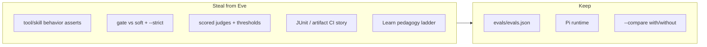
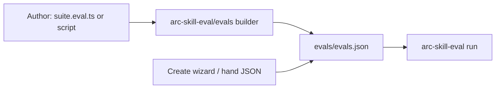

# Leverage Eve for skill evals (without adopting defineEval)

Decision / strategy note: 2026-07-22. Companion to [evals-json-pivot.md](./evals-json-pivot.md) and [laminar-integration-research.md](./laminar-integration-research.md).

Primary Eve references: [defineEval overview](https://eve.dev/docs/evals/overview), [assertions](https://eve.dev/docs/evals/assertions), [judge](https://eve.dev/docs/evals/judge), [cases](https://eve.dev/docs/evals/cases), [running evals](https://eve.dev/docs/evals/running).

## Verdict

**Do not switch to Eve `defineEval`.** Eve and arc-skill-eval solve different problems:

| | Eve | arc-skill-eval |
|---|---|---|
| Unit under test | An HTTP `defineAgent` app | A portable `SKILL.md` skill |
| Authoring | Imperative `.eval.ts` with `test(t)` | Declarative `evals/evals.json` co-located with the skill |
| Runtime | Live eve server / session protocol | Pi agent loop + fixtures / sandbox |
| Ecosystem bet | Vercel/eve agent apps | Anthropic skill-eval methodology + agentskills.io |

We already pivoted *to* Anthropic's format in [evals-json-pivot.md](./evals-json-pivot.md) for portability and trust ("every skill ships with an eval"). Adopting `defineEval` would reverse that: evals would become TypeScript tied to an eve app, not a skill artifact that travels with `SKILL.md`.

**What we should do:** treat Eve as a reference implementation for *eval ergonomics and teaching*, then close the gaps where our types already exist but grading does not.



## What Eve gets right (steal these)

1. **Drive + assert on one surface** — Eve's `t` is both session driver and assertion API. Our declarative JSON can't be identical, but Learn should teach the same mental model: *prompt drives, assertions grade, cheapest check wins*.
2. **Behavior assertions first** — `t.calledTool`, `t.notCalledTool`, `t.toolOrder`, `t.loadedSkill`, `t.usedNoTools`. We already declare intent forms in `src/evals/types.ts` (`tool-call-required`, `tool-call-forbidden`, `skill-read-required`) but `src/evals/assertion-engine.ts` still returns *"not implemented yet"* for behavior/safety. Eve shows the product value of making these real.
3. **Gate vs soft severity on the assertion** — Eve puts severity on the handle (`.gate()` / `.soft()` / `.atLeast()`), with `--strict` for CI. We have `mustPass` / `severity` fields but Learn and CLI treat everything as hard pass/fail. Soft judge scores + strict CI is the missing middle for style/quality checks.
4. **Judge only when deterministic fails** — Eve's ladder (scoped → `t.check` → `t.judge.autoevals`) matches our authoring skill's priority but is taught more clearly. Their autoevals graders (`closedQA`, `factuality`) are better-named than free-form string rubrics.
5. **CI packaging** — `eve eval --strict --junit` + `.eve/evals/<ts>/` artifacts. We have rich per-case artifacts; the Learn/Run story should make the CI recipe as obvious.
6. **Small smoke baseline** — Eve docs push a few behavioral smokes before datasets/judges. Aligns with `arc-creating-evals` (6–10 cases) and should be the Learn Create chapter's north star.

## What *not* to copy

- **`.eval.ts` / `defineEval` as the primary format** — breaks skill portability and Anthropic alignment.
- **HTTP target model (`t.target`, schedules, channels)** — wrong substrate for skill evals on Pi workspaces.
- **Path-as-id file fan-out** — our stable case `id` inside one `evals.json` is better for skill-adjacent suites.
- **Full multi-turn imperative scripting** — useful later as an *optional* extension (`turns[]` in JSON), not a rewrite. Most skill evals are single-prompt + workspace outcome.

## Recommended workstreams

### A. Runtime: finish Eve-shaped assertion surfaces we already typed

Highest leverage, stays on `evals.json`:

- Implement trace-aware grading for `BehaviorAssertion` / `SafetyAssertion` using existing `trace.json` / `tool-summary.json` from runs (`src/evals/assertion-engine.ts`).
- Map Eve vocabulary → our JSON kinds for authoring guidance:
  - `calledTool` → `{ kind: "behavior", method: "tool-call-required", value }`
  - `notCalledTool` → `tool-call-forbidden`
  - `loadedSkill` → `skill-read-required`
- Add matcher basics where cheap: exact tool name + optional input substring/regex (Eve's full predicate language can wait).
- Teach and prefer these in `skills/arc-creating-evals/SKILL.md` Phase 4 *above* string judges when process is the claim.

### B. Runtime: gate / soft / thresholds (Eve severity model)

- Honor `mustPass: false` / `severity: "info"|"warn"` as soft: recorded in `grading.json`, do not fail the case by default.
- Add CLI `--strict` so soft misses fail the exit code (CI gate).
- Optional follow-on: scored judge assertions (0–1) with `atLeast`, inspired by `t.judge.autoevals.closedQA(...).atLeast(0.8)`, without requiring Braintrust.

### C. Learn section: teach Eve *principles* in our product language

Update chapters under `web/src/sections/learn/` (keep the seven-chapter rail from `chapterList.ts`; deepen content, don't add Eve as a product):

| Chapter | Steal from Eve |
|---|---|
| **Create** | "Smoke first": succeeded-equivalent + 1–2 content/behavior checks before datasets; assert *effect*, not paraphrased instructions |
| **Assert** | Explicit ladder: script/workspace → behavior/tool → regex/exact → judge; "judge burns tokens — last resort"; preview gate vs soft once B lands |
| **Signal** | Keep with/without (our differentiator Eve lacks); contrast Eve's absolute gates vs our delta signal |
| **Run** | CI recipe: exit codes, `--strict`, upload `evals-runs/` artifacts; "console tight, artifacts have the story" |
| **Pi** | Pair with Eve's `mockModel` idea: when to use sandbox mocks / fixtures for deterministic process checks without live model noise |

Also fix Learn drift vs runtime where Assert documents types that don't exist yet (`file-absent`) or aren't implemented (behavior) — either ship them or label as upcoming so the reader isn't lied to.

**Repo findings to reconcile while doing this:**

- Learn currently ships as hardcoded TSX chapters (`web/src/sections/learn/chapters/`); richer MDX under `docs/web-app/learn/` is not loaded. Pick one source of truth (recommend: keep TSX authoritative for the app, treat MDX as draft/spec until wired or deleted).
- Create emits a thinner `evals.json` than the runtime supports (missing `expected_output`, `setup`/`files`, assertion ids/severity, behavior/intent kinds). Align Create after behavior grading lands.
- Progress persistence exists but only chapter selection is wired; scroll/completion hooks are unused.
- Canonical `skills/arc-creating-evals/SKILL.md` and the `.agents` mirror are not byte-identical — reconcile when updating authoring guidance.
- No project references to Eve today; Evalite was the only named alternate framework experiment and was not merged.

### D. Typed builder that emits JSON

**Goal:** give power users Eve-like authoring ergonomics (typed helpers, composition, dataset fan-out, severity on the assertion) while keeping **`evals/evals.json` as the only runtime/discovery contract**.

This is **not** Eve `defineEval`. There is no `async test(t)`, no `t.send`, no live session driver. The builder constructs an `EvalsJsonFile` (same shape as `src/evals/types.ts`); the existing Pi runner stays unchanged.



#### Public API (proposed)

Export from something like `arc-skill-eval/evals` (package `exports` entry; implementation under `src/evals/builder/`):

```ts
import {
  defineSkillEval,
  evalCase,
  seeded,
  fileExists,
  jsonValid,
  regexMatch,
  judge,
  toolRequired,
  toolForbidden,
  skillReadRequired,
} from "arc-skill-eval/evals";

export default defineSkillEval({
  skill_name: "arc-conventional-commits",
  version: "1",
  cases: [
    evalCase({
      id: "execution-clean-repo",
      description: "Golden path on an empty npm package",
      prompt: "Set up semantic-release with conventional commits in this repo.",
      expected_output: ".releaserc.json + release script",
      setup: seeded({ from: "files/clean-repo", to: ".", mountMode: "flatten-contents" }),
      metadata: { tags: ["execution", "golden"], difficulty: "easy" },
      assertions: [
        fileExists(".releaserc.json"),
        jsonValid(".releaserc.json"),
        regexMatch("conventionalcommits", { file: ".releaserc.json" }),
        toolRequired("Write"), // once behavior grading ships
        judge("Confirms no prior versioning tooling was detected").soft(), // tracked unless --strict
      ],
    }),
  ],
});
```

**Assertion helpers** return plain `EvalAssertion` objects (or a thin `AssertionBuilder` that is JSON-serializable via `toJSON`):

| Helper | Emits |
|---|---|
| `fileExists(path)` | `{ type: "file-exists", path }` |
| `jsonValid(path)` | `{ type: "json-valid", path }` |
| `regexMatch(pattern, opts?)` | `{ type: "regex-match", … }` |
| `judge(prompt)` | string **or** `{ kind: "output", method: "judge", prompt, id }` |
| `toolRequired(name)` / `toolForbidden(name)` | behavior intent objects |
| `skillReadRequired(name?)` | behavior intent |
| `exact(expected)` / `outputRegex(pattern)` | output intent |

**Severity (Eve-inspired, declarative):** chain on the builder handle, bake into `mustPass` / `severity` (and later score thresholds):

- `.gate()` → hard fail (default for script/behavior)
- `.soft()` → `mustPass: false` / `severity: "warn"` (default for judge once soft severity ships)
- `.atLeast(n)` → reserved for scored judges (post gate/soft workstream)
- `.id("…")` → stable assertion id for grading joins

Helpers must be **pure and sync**. No I/O inside assertion builders; fixtures stay as `setup` / `files` data.

#### Dataset fan-out (primary reason to want the builder)

```ts
import { loadJson } from "arc-skill-eval/evals/loaders"; // thin, fixture-relative

const rows = await loadJson<{ id: string; prompt: string; needle: string }[]>(
  "evals/data/triggers.json",
);

export default defineSkillEval({
  skill_name: "arc-conventional-commits",
  cases: rows.map((row) =>
    evalCase({
      id: row.id,
      prompt: row.prompt,
      assertions: [
        judge(`Response addresses: ${row.needle}`).soft(),
      ],
    }),
  ),
});
```

Same idea as Eve’s array-exported `defineEval`s, but the product is still one `evals.json` blob (or one emit per skill).

#### Emit / discovery contract (locked)

1. **Canonical on disk for runs:** `<skillDir>/evals/evals.json`
2. **Builder source (optional):** e.g. `<skillDir>/evals/suite.eval.ts` or a repo script — never required
3. **Emit paths (pick both eventually, ship CLI first):**
   - Library: `suite.toJSON()` / `JSON.stringify(suite, null, 2)` where `defineSkillEval` returns a branded object with `toJSON(): EvalsJsonFile`
   - CLI: `arc-skill-eval emit <skillDir>` or `arc-skill-eval emit --from evals/suite.eval.ts --out evals/evals.json`
4. **Runner does not import TS suites by default.** Avoids dual discovery, Evalite-shaped load-time side effects, and hosted/Create divergence. Emit is an authoring step (local or CI codegen check).
5. **CI option:** `emit --check` fails if committed `evals.json` drifts from the builder source (like generated lockfiles).

#### What `defineSkillEval` validates at build time

Reuse / wrap `src/evals/loader.ts` validators so emit fails early on:

- duplicate case ids
- invalid assertion shapes
- setup/source path shape (existence check optional at emit; required at run)

#### Relationship to Create / Learn / authoring skill

- **Create wizard** keeps writing JSON directly (no TS required for the common path).
- **Learn** teaches JSON first; a short “Advanced: typed builder” callout shows the helper → JSON mapping (Eve pedagogy without Eve runtime).
- **`arc-creating-evals`** may *optionally* emit a `suite.eval.ts` + generated `evals.json` for authors who prefer TS; default remains JSON-only.

#### Sequencing relative to other workstreams

Builder value is low until behavior asserts and soft severity exist — otherwise helpers wrap half-implemented types. Order:

1. Behavior/safety grading + soft/`--strict`
2. Thin `src/evals/builder/` + `toJSON` + unit tests that round-trip to loader
3. `arc-skill-eval emit` (+ optional `--check`)
4. Learn advanced callout + authoring-skill optional TS path
5. Dataset loaders only if someone needs fan-out beyond hand JSON

#### Explicitly out of scope for v1 builder

- Imperative `test(t)` / multi-turn send/respond
- Discovering `.eval.ts` as a run input without emit
- Braintrust/autoevals coupling
- Replacing Anthropic string assertions (strings remain valid; `judge()` may emit them)

### E. Explicit non-goal (unless later requested)

Do **not** wire `eve` / `eve/evals` as a dependency or second runner. If we ever want Eve as a host, that is a separate ADR: "Pi skill evals vs Eve agent evals," not a drop-in for `defineEval`.

## Suggested sequencing

1. **Learn content pass (immediate, low risk)** — assertion ladder + smoke-first Create + Run CI framing; call out unimplemented behavior asserts honestly.
2. **Implement behavior/safety grading from traces** — unlocks Eve's best assertion idea inside our format.
3. **Soft severity + `--strict`** — unlocks scored/quality checks without flaky CI by default.
4. **Authoring skill + Create wizard** — prefer behavior asserts in `arc-creating-evals` and create UI once runtime supports them.
5. **Typed JSON builder** — `defineSkillEval` / assertion helpers / `emit` (+ `--check`); Learn advanced callout. After 2–3 so helpers map to real graders.

## Bottom line

Eve's `defineEval` is an excellent *design reference*, not our next authoring format. Keep `evals.json` as the skill-portable contract; steal Eve's assertion richness, severity model, and teaching clarity; use Learn to make those principles obvious to authors. A **typed builder that emits JSON** is the right programmatic layer: Eve ergonomics for authors, Anthropic shape for the ecosystem, zero second runner.
