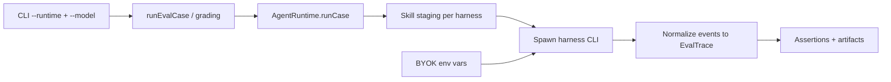

# Multi-harness runtimes and BYOK

_Last updated: 2026-07-24_

## Why

`arc-skill-eval` defaults to the Pi SDK so skill evals use a consistent tool loop, skill loader, and trace format. Many users already have **Claude Code**, **Codex**, **Cursor Agent**, or **GitHub Copilot CLI**, and some environments cannot install Pi.

This document describes how we add those harnesses as optional `AgentRuntime` adapters while keeping:

- the same `evals/evals.json` contract
- the same grading + artifacts pipeline
- **bring-your-own keys (BYOK)** via environment variables (never pasted on the CLI, never written into artifacts)

The same adapters also allow cross-harness comparisons on one suite. Their primary purpose is to run evals without Pi and use credentials supplied through the environment.

See also: [ADR-0007](./adr/ADR-0007-multi-harness-cli-runtimes.md), [agent-runtime-strategy.md](./agent-runtime-strategy.md), [ADR-0001](./adr/ADR-0001-defer-agent-runtime-expansion.md) (partially superseded).

## Approach

Spawn each harness’s **headless CLI** inside the prepared case workspace, parse its machine-readable event stream (JSON / JSONL), normalize into `EvalTrace`, then reuse existing assertions and artifacts.

The first implementation does **not** embed vendor SDKs. The installed CLIs already handle authentication, updates, and skill discovery.



## BYOK contract

| Runtime id | Binary | Primary credentials (env) | Notes |
|---|---|---|---|
| `pi-sdk` (default) | (SDK dependency) | Pi `models.json` apiKey env names / `~/.pi/agent/auth.json` | Unchanged |
| `codex` | `codex` | `CODEX_API_KEY` (or prior `codex login`) | Prefer key in CI |
| `claude-code` | `claude` | `ANTHROPIC_API_KEY` (or Claude subscription login) | Prefer key in CI |
| `cursor-agent` | `cursor-agent` | `CURSOR_API_KEY` | Prefer key in CI |
| `copilot` | `copilot` | `COPILOT_GITHUB_TOKEN` / `GH_TOKEN` / `GITHUB_TOKEN` | Needs Copilot entitlement |

Rules:

- Keys stay in the process environment (or harness-native login).
- Never copy keys into `evals-runs/`, Laminar payloads, traces, or logs.
- Preflight checks binary on `PATH` + required env (or documented login) before cases run.
- Judge auth is independent: `--judge-model` keeps its own provider keys; a missing judge key fails/skips judge asserts, not the runner.
- No `--api-key` CLI flag (avoids shell history leakage).

## Skill staging

Adapters stage the target skill into the harness discovery tree inside the case workspace:

| Runtime | Staging path |
|---|---|
| Codex | `.agents/skills/<name>/SKILL.md` |
| Claude Code | `.claude/skills/<name>/SKILL.md` |
| Cursor Agent | `.cursor/skills` and/or `.agents/skills` (confirmed by smoke) |
| Copilot | `.github/skills` / `.agents/skills` / `.claude/skills` |

`attachSkill: false` (without_skill / baseline lane) skips staging the target skill. `extraSkillPaths` stage as distractors the same way.

## CLI shape

```bash
# Default: Pi SDK (unchanged)
arc-skill-eval run ./skills/hello-world

# Codex (BYOK via CODEX_API_KEY)
arc-skill-eval run ./skills/hello-world --runtime codex --model <codex-model-id>

# Other shipped CLI harnesses
arc-skill-eval run ./skills/hello-world --runtime claude-code
arc-skill-eval run ./skills/hello-world --runtime cursor-agent
arc-skill-eval run ./skills/hello-world --runtime copilot
```

## Harness limitations

- `--sandbox just-bash` is supported only for `--runtime pi-sdk`. CLI harnesses reject other `--sandbox` values before spawn.
- Harness process stderr is redacted/truncated in trace forensics; raw stderr is not written to `evals-runs/`.
- A non-zero harness CLI exit code fails the eval case even when partial assistant text was parsed from stdout.
- Workspace copies into `outputs/` exclude harness skill staging trees (`.agents/skills`, `.claude/skills`, `.cursor/skills`, `.github/skills`).

## Rollout status

| Runtime | Status |
|---|---|
| `pi-sdk` | Default (shipped) |
| `codex` | Shipped (`--runtime codex`) |
| `claude-code` | Shipped (`--runtime claude-code`) |
| `cursor-agent` | Shipped (`--runtime cursor-agent`); skill staging writes both `.cursor/skills` and `.agents/skills` |
| `copilot` | Shipped (`--runtime copilot`); requires Copilot CLI + token entitlement |

## Known limitations

- Vendor event schemas differ; normalizers must map assistant text, tools, file touches, usage, and failures without assuming Pi event names.
- Automatic skill *selection* remains model-dependent after staging. Evals that need "skill was read" should use behavior assertions once trace grading lands.
- Codex defaults lean read-only; file-producing evals need `workspace-write` (and a non-interactive approval policy).
- Cursor CLI skill docs lag the installed binary; treat skill staging as experimental until smoked.
- Copilot prompt mode may disable some repo-controlled extensions/MCP by default.
- Behavior/safety assertions in `evals.json` are still unimplemented in the grader; workspace/script/string asserts work across runtimes today.

## Explicit non-goals

- Replacing Pi as the default runtime
- Building a custom in-process tool loop as the escape hatch (old Option B in agent-runtime-strategy)
- Storing or proxying user API keys through the web app
- Treating Braintrust/Laminar as runtimes (they remain reporters/sinks)
